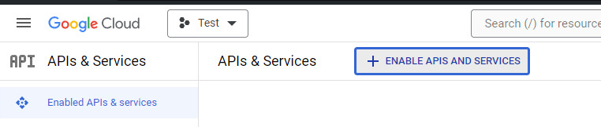
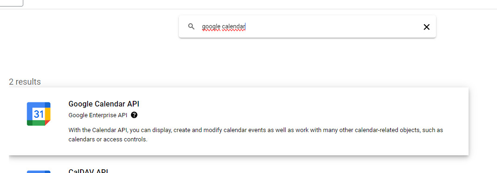
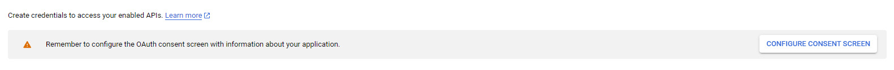
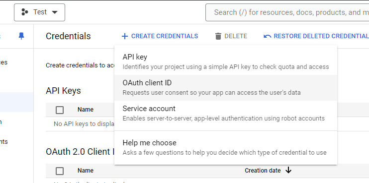
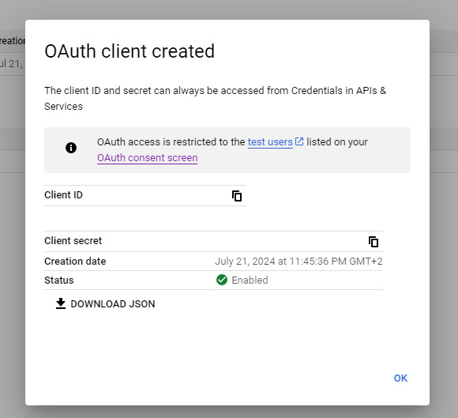

# How to obtain credentials.json

Firstly, create a new project on [Google console](https://console.cloud.google.com/projectcreate).

Now click on Enable Apis and Services

Search for Google Calendar and enable it.

Under Credentials, configure the consent screen. (select the default and input necessary email adresses and names)

Under credentials click on create credentials and select OAuth client ID

Select desktop app and click on create.

Then back on the Credentials page click on the newly created OAuth 2.0 Client ID and download the credentials.json file.
