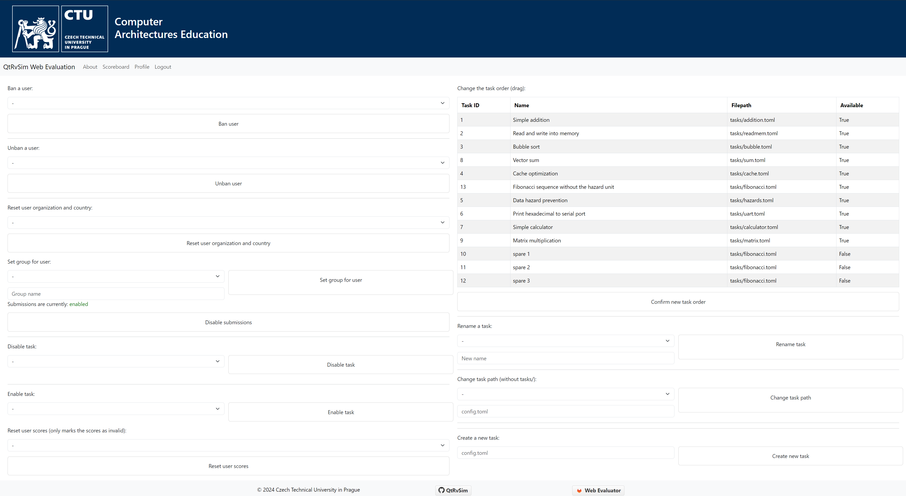

# Admin panel



## Access to admin panel

All user that have the `is admin` flag set in the database have access to this. The admin panel is located at `/admin`.

### User management

Select a user from the dropdown menu and click on the neighboring button to ban or unban the user.


Similar input fields are available for country and organization reset.

#### User groups

Users can be managed into groups and organizations by a `Set group for user` section. Users select a country and organization on their [profile page](../user/profile), they can then be assigned into study groups by an administrator.

::: info
Users are able to select their country and organization only from a select list defined in `/web/static/organizations.json`. If you need to add another organization to the list you can do so in the following format:
```json
{
		"web_pages": [
			"https://fel.cvut.cz/en"
		],
		"name": "FEE CTU in Prague",
		"alpha_two_code": "CZ",
		"state-province": null,
		"domains": [
			"cvut.cz",
			"fit.cvut.cz",
			"fel.cvut.cz"
		],
		"country": "Czech Republic"
}
```
The list of universities is managed by [university-domains-list](https://github.com/Hipo/university-domains-list).
:::

#### Reset user scores

You can reset all user scores in the `Reset user scores` section. This automatically invalidates all results of a specific user.

::: details
This marks all submissions by a [result code `100`](../dev/evaluator) which is shown to the user as `Reset by admin`.
:::


### Task re-evaluation and submission inspection

Apart from access to the admin panel, administrators have also the ability to inspect all submissions by clicking the eye icon next to the score. They can also click on the arrow icon, to clear the score and set the task for re-evaluation.

::: details
The re-evaluate button sends a database query to queue up a new submission with the source code of the best submission of the user. This is done by sending a request to `/admin/reevaluate/<int:task_id>/<int:user_id>/<int:is_best>`, eg. for tid and uid both 1: `/admin/reevaluate/1/1/1`. You can force re-evaluation of the latest submission by changing the `is_best` parameter to `0` : `/admin/reevaluate/1/1/0`.
:::

### Changing the task order, creating and renaming the tasks

You can change the task order, by dragging the tasks in the table on the right side of the page. After you arrange the tasks in the desired order, click on the corresponding button to save the changes.

Task creation, renaming and path changes can be managed by the buttons below the task table.

::: warning
In the task creation dialogs, no task is actually created. You need to manuall create a task `.toml` file in the `web/tasks/` directory. Then you enter the path to the file in the corresponding input field.
:::

