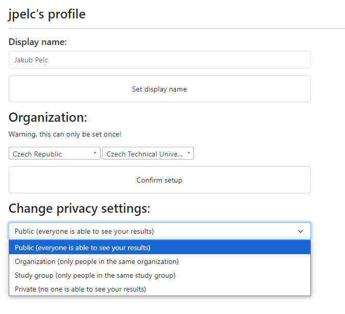

# Profile page

On this page you can customize your profile a little bit.

## Display name change

You can change your display name which is then displayed in the leaderboard.

::: details
The user name will always be displayed even if the display name is set. This is to prevent confusion in the scoreboard.

The full name in the scoreboard is displayed as `display name (username)`.
:::

## Setting country, organization and a study group

In this section, you can set the country and organization you are affiliated with. This will be your university. If you do not find your university in the list, please contact the administrator (most likely your teacher).

::: tip
You can configure this only once, if you happen to make a mistake, please contact the administrator.
:::

Your teacher can then assign you into a study group.

## Setting results privacy

At the bottom of the page you can set a privacy level for your results.

| Privacy level | Description |
|---------------|-------------|
| Public | Everyone can see your results |
| Organization | Only users from your organization can see your results |
| Study group | Only users from your study group can see your results |
| Private | Only you can see your results |

This influences the visibility of the [scoreboard](./scoreboard) and the [results](./results) page.