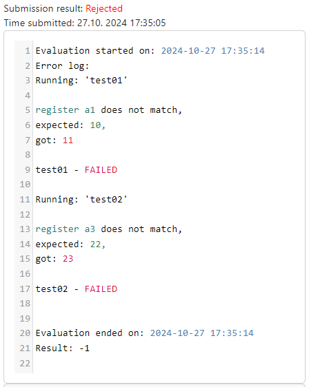
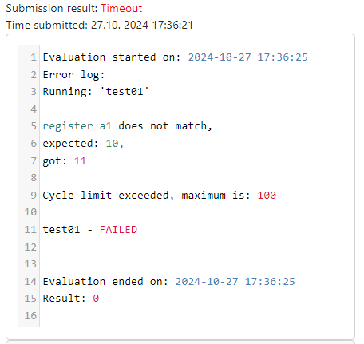
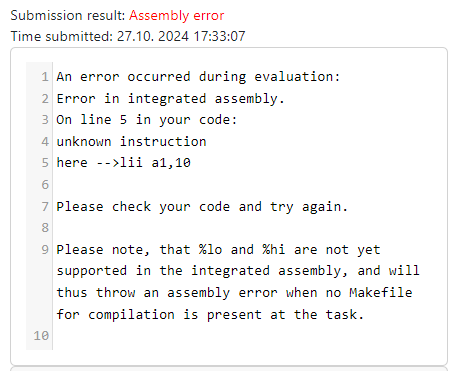
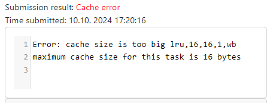
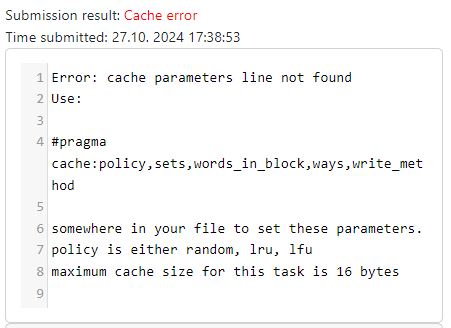
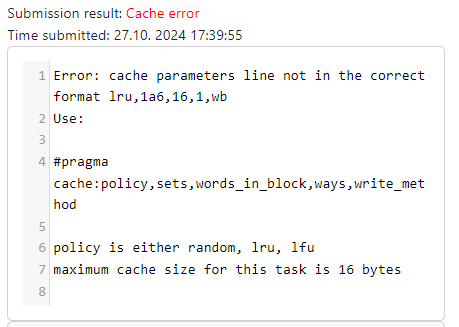
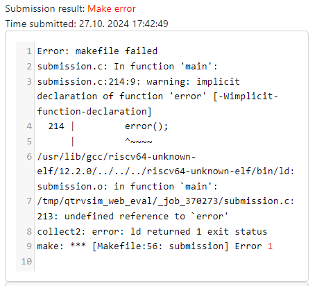

# Reading the evaluation log

After submitting one of the tasks, you will be able to see the evaluation log. This log contains information about the evaluation of your submission, and can help you understand what went wrong (if anything did).

## Errors

If you make an error in your code, it will be reported to you by an error message. Here are some common examples of errors, and how to fix them.

### Wrong output


Mostly caused by an incorrect algorithm, check for off-by-one errors, or other common mistakes.

### Timeout


Your solution took too long to execute, try to optimize your code.

### Assembly error


There is a syntax error in your code, on the lines highlighted in the error log.

### Cache errors

These errors occur when the required `#pragma cache` is not set / is set incorrectly in specific cache tasks.

#### Size to big



#### Pragma is missing



#### Pragma malformed



Check the `#pragma cache` is set to the corect values with the correct format.

### Make errors

Make errors will occur (mostly) when the compilation of the source code fails (the code is compiled in tasks, where the submission is required in `C`, and also in some other tasks where the integrated assembler is not enough).

This can be either by having a syntax error, or by not including the necessary libraries (or including some that are not present).



For example, this error occurs in this code:

```c
int main(int argc, char *argv[]) {
	int num = get_int_from_serial();
	write_int_to_ser(num);

	delayNOP(500);
	error();
	return 0;
}
```

we are calling a function `error()` that is not defined in the code. That is why a make error is raised.