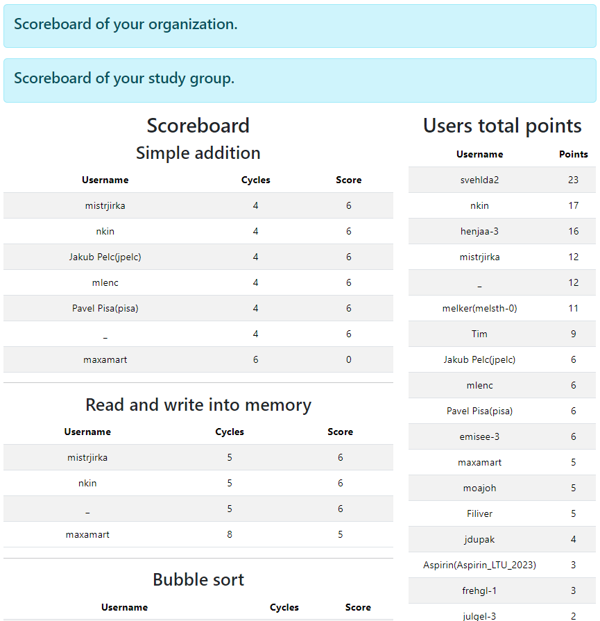

# Scoreboard

This page shows the scoreboard of all users across all tasks.



# Scoring algorithm

Each task awards points to 5 users maximum. Only if there are multiple users with the same amount of cycles, the points are awared to all of them. This is done in groups with values of points decreasing from `6` by `1` for each group.

::: details

The scores are awared by the following algorithm:

```plaintext
1. Initialize an empty list for new results.
2. If there are no results, return an empty list.
3. Determine the worst score among the top 5 scores.
4. Separate results into two groups:
   - Group 1: Scores <= worst top 5 score.
   - Group 2: Scores > worst top 5 score.
5. Initialize points awarded to 6.
6. Score Group 1:
   - While Group 1 is not empty:
     - Find the minimum score in Group 1.
     - For each result with this score:
       - Add to new results with current points.
       - Remove from Group 1.
     - Decrease points awarded by 1.
7. Award 0 points to Group 2.
8. Sort new results by points awarded in descending order (order is the same as by the number of cycles).
9. Return new results.
```
:::

## Scoreboard for organizations and study groups

If you configured you organization on the [profile page](../user/profile.md), or you were assigned to a study group by an administrator, you can see the scoreboard for your organization or study group. You can find these scoreboard by clicking the corresponding link on the scoreboard page.