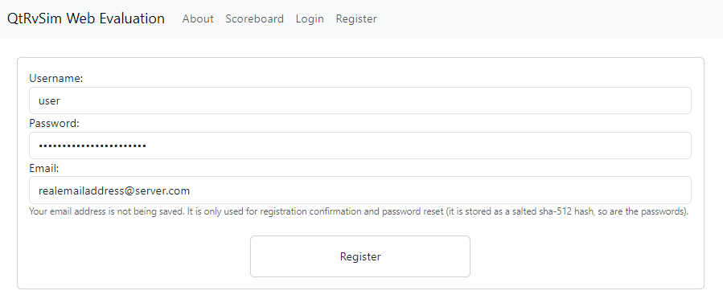
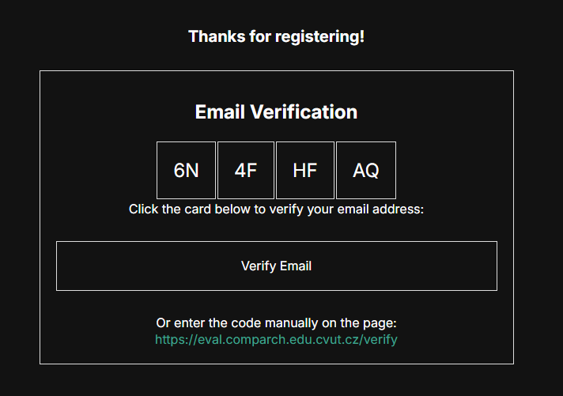

# Creating an account

To be able to use the application, create an account on the [Registration page](https://eval.comparch.edu.cvut.cz/register). You will need a working email address to register 

:::info
We do not store password, nor email addresses in plaintext form, both are being salt hashed by `sha512`.
:::

After you have registered you will receieve and email with a verification link. Click on the link to verify your account, or enter the code manually on the [verification](https://eval.comparch.edu.cvut.cz/verify) page. 

If you were to forget you password, you can reset it on the [password reset](https://eval.comparch.edu.cvut.cz/reset) page. You will receive an email with a link to reset your password. (you need to remember your username and email to complete the reset process).

When you login to the application, you can now submit tasks and compare your code execution time with other users.

You can also customize your profile on the [profile](https://eval.comparch.edu.cvut.cz/profile) page (change your display name, organization, study group and privacy settings).