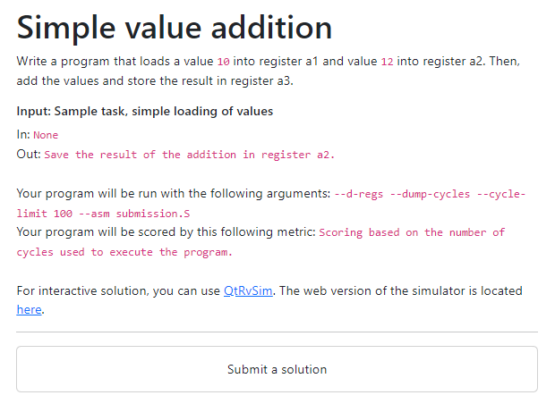
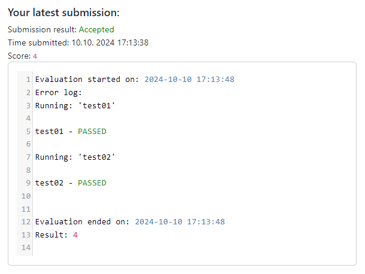
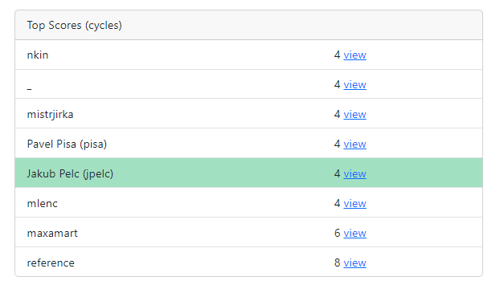
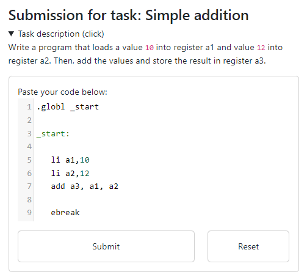
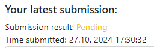
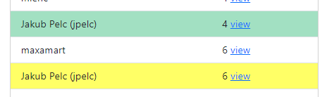

# Solving a task

## UI Overview

On the front page, you can see a list of tasks available for submission. They are ordered by a level of difficulty, so we recommend starting with the first ones and subsequently moving to more difficult tasks.

Let us use the first task as an example of the user interface.

### Task description

On the left of the page, you can see the task description. Here you can see the task name, description, and the input and output format.



### Results

In the middle of the page, there is a section for the results of your submissions. The score is determined by the runtime of the program in cycles.



### Leaderboard

Here you can see the run times of other users that have submitted the task. You can see your best solution in green and your last in yellow.

Your username is displayed in the brackets, your display name is displayed in displayed in front of it. If you click on view next to the score, you can see your submission, admins can see all submissions.



## Writing a solution to the task

The first task asks us to write a program, that loads a value `10` into register `a1`, and load a value `12` into `a2`. It then should add the values and store the result in `a3`.

One of the possible solutions to this task can for example be:

```asm
.globl _start

_start:

	li a1,10
	li a2,12
	add a3, a1, a2

	ebreak
```

## Submitting a solution

Click on the `Submit` a solution button, this page will open:

Write your solution in the integrated editor, and submit it. You can view the starting template for the task by clicking on the `Reset` button.



You will see that the solution is being evaluated:



And after a while you can see the page reload and the loaderboard update:



If you do not see an `Accepted` status, check some other possible errors [here](./results).