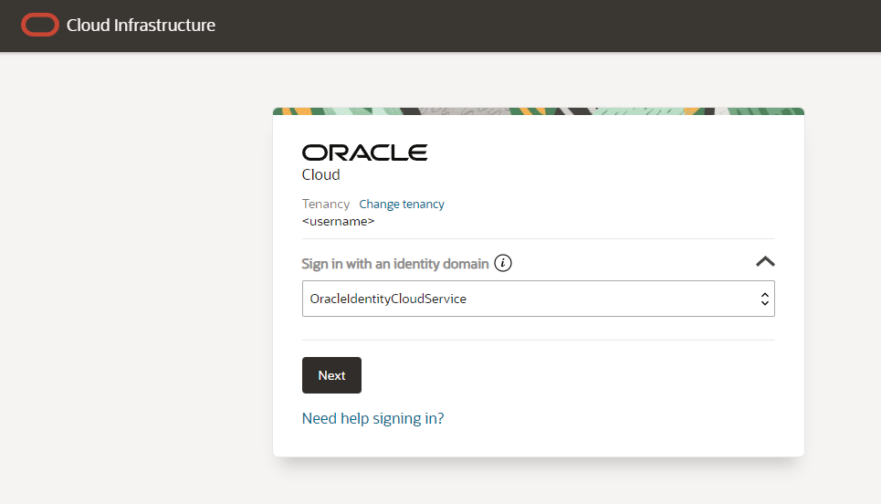

# Hosting a VPS on Oracle Cloud Infrastructure (Always Free Tier)

::: warning
This tutorial is written in a way, in which I have found out things work. It may not be the best way to do things, but it works (or at least I hope it does). If you have any suggestions or improvements, please let me know, and I will update this page (or you can do it yourself with the edit button).
:::

## Account creation

Go to the [Oracle Cloud Free Tier signup page](https://www.oracle.com/cloud/free/) and create an account. You will need to provide a credit card, but you will not be charged unless you upgrade to a paid plan.

::: info
You may need to wait a few days and have a lengthy conversation with Oracle support to get your account approved. The process is quite annoying sometimes and the menus can be bloated, this may mainly be because Oracle is a business-oriented company and not a consumer-oriented one.

I also recommend selecting Netherlands/Northwest (Amsterdam) as your region, for the availability of Ampere A1 instances, which were not that abundant in the Frankfurt region.
:::

After you will have your account approved, you can log in to the [Oracle Cloud Infrastructure](https://www.oracle.com/cloud/sign-in.html) page and start setting up your servers.



## Instances menu

Click on the hamburger menu in the top left corner and navigate to **Compute** -> **Instances**.


You will now see a list of your instances (which will be empty).


Here you can see your servers with their public IPv4 addresses, configuration and status.

## Instance creation

Click on the **Create Instance** button to create a new instance.

### Basic Information

Fill in the basic information about your instance.


### Image and shape

Select the server image and shape. You can also upload your own image, if you wish to do so.


#### Shape

From the list of available processors, only two `VM.Standard.E2.1.Micro` are available (under `Specialty and previous generation`), or you can use the `Ampere A1 Flex` instances up to `3000 OCPU hours and 18000 GB hours` per month.


### Add SSH keys

Here you can let Oracle generate a new SSH key pair for you, or you can upload your own public key.


::: danger
If you let Oracle generate a new key pair for you, you will not be able to download the private key later. Make sure to save it somewhere safe.
:::

### Boot volume

Select the boot volume size and type (50GB free for each instance).

#### Boot volume price bug

There is a bug in the Create compute instance, where the final price for a boot volume is calculated at `CZK 41.80 / month`, but this is actually never billed and is in the Always Free Tier allowance.


You can read more on [Reddit](https://www.reddit.com/r/oraclecloud/comments/14pg5dr/oracle_always_free_service_have_boot_volume_cost/) on this topic.

## Logging in
After you have created your instance, you can log in to it using the public IP address and the private key which you have generated or uploaded.

If you got the private key from Oracle, you can use it to log in like this:

```bash
ssh -i private.key ubuntu@address
```

::: info
The default username for the Ubuntu image is `ubuntu`. For other images, it may be different. You can find this info under the *Instance access* on the Instance details page.


:::

After you login, you can update the system and install the software you need.

```bash
sudo apt update
sudo apt upgrade
```

## Networking

If you now try to start a web server, you will notice that you cannot access it from the outside. This is because the firewall is blocking all incoming traffic.

It is actually two firewalls, one in the Oracle Cloud Infrastructure and one in the server itself.

### Virtual Cloud Network

Locate the VCN link in the Instance details menu.


On the VCN page you can see a list of subnets.


Click on the only one created.

On the subnet page you will see a list of security lists.


#### Ingress rules

On the security list page you can see the ingress rules.


Here you can click on `Add Ingress Rule` to add a new rule. To add a rule for TCP traffic on port 80, you can do something like this


If you want to run an HTTPS server, you would add a similar rule for port 443.

### Server firewall

You now also need to allow the ports on your server. You can do this in many ways, but the simplest one I found is the `firewall-cmd` tool.

```bash
sudo apt install firewalld
sudo systemctl enable firewalld
sudo systemctl start firewalld
```

After you have installed the firewall, you can add the rules for the ports you need.

```bash
sudo firewall-cmd --zone=public --permanent --add-port=80/tcp
sudo firewall-cmd --reload
```

You should now have a reachable web server on your Oracle Cloud Infrastructure instance.